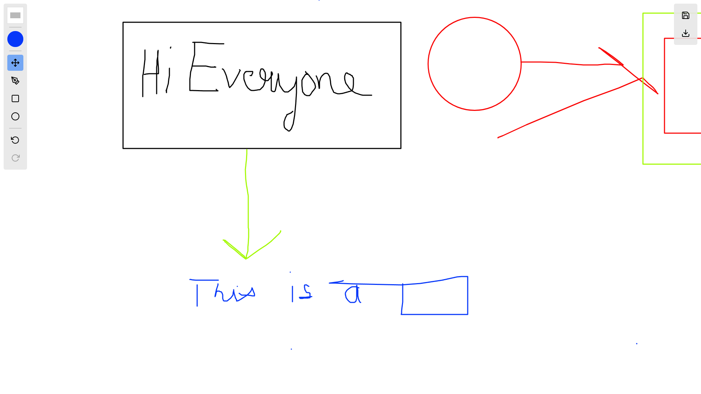

# React Canvas Drawing Tool

Welcome to the React Canvas Drawing Tool! This is a versatile drawing application built with ReactJS, offering a range of features to unleash your creativity. Whether you're an artist or just looking for a fun way to express yourself, this tool has got you covered.



## Want to try it out ?

[Click here: draw-8zm4xot52-sachin-prasads-projects.vercel.app](https://github.com/SachinBunnY/draw_it)

## Features

### 1. Pen Tool

Draw freely with the pen tool, allowing you to create intricate designs with precision.

### 2. Rectangle Tool

Easily draw rectangles on the canvas, perfect for creating structured shapes and patterns.

### 3. Circle Tool

Create perfect circles effortlessly using the circle tool, adding a touch of symmetry to your artwork.

### 4. Color Tool

Choose from a wide range of colors to bring your drawings to life. The color tool lets you express your creativity with a vibrant palette.

### 5. Movable Canvas

Navigate and explore your canvas with ease. The tool provides a movable canvas to focus on specific areas of your artwork.

### 6. Undo and Redo Feature

Made a mistake? No worries! The undo and redo features allow you to easily correct and experiment with different ideas.

### 7. Cross Platform

Works seamlessly on both touch-based inputs and mouse interactions!

### 8. Export and Import Drawn Canvas

Save your masterpieces! Export your drawings to ediate json format and import them back to continue your work later.

## Getting Started

1. Clone the repository.
   ```bash
   git clone https://github.com/your-username/draw_it.git
   ```
2. Install dependencies.
   ```bash
   cd draw_it
   npm install
   ```
3. Run the development server.
   ```bash
   npm start
   ```

## Note

**This is still in early stages of development, architecture changes are expected which might break the import feature for old exported drawings.**
